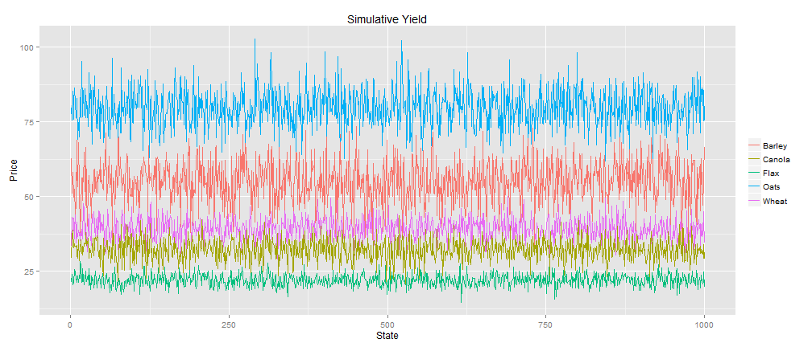

## Motivation: A Model is Essential for Policy Analysis

### Impact of policies
 
###     Farm's

  **REVENUE** 

###     Prodcution

 **COST**

###     Crop

 **YIELD**

###     Crop

 **PRICE**

---
## Assumption of the Model
1. **Cost** is **fixed**
 - Cost is based on the farmers' operation and the situation of farm or soil. For cerntain area and time period, we assume it fixed. 
 
2. **Yield** is **normally** distributed
 - Yiled depends on something like weather or other random factors. 
 
3. **Price** following a **stochastic** process.
 - Price changes frequently, even in short term, like other commodity price.

---  
## Data Source and Description

- Five major crops in SK:  **Wheat, Oats, Barley, Flax, Canola**  

- The **monthly price** data is from **Statistics Canada** [_"Estimated areas, yield, production, average farm price and total farm value of principal field crops, in imperial units, annually 001-0017"_](http://www5.statcan.gc.ca/cansim/a26?lang=eng&retrLang=eng&id=0010017&tabMode=dataTable&srchLan=-1&p1=-1&p2=35).

 * The data covers 1985-12-01 to 2014-03-01
 
- The **annual yield** data is from  **Statistics Canada** [_"Farm product prices, crops and livestock, monthly Description 	002-0043"_](http://www5.statcan.gc.ca/cansim/a05?lang=eng&id=0020043&pattern=0020043&searchTypeByValue=1&p2=35)

 * The data covers 1991 to 2013 
 
- The **cost** per acre data is from **Government of Saskatchewan** [_"Crop Planning Guide"_](http://www.agriculture.gov.sk.ca/crop-planning-guides)

 * The data covers different soil zones, rotations, estimated yield, variable cost, fix cost.  

- The **farm** data from **Statistics Canada** [_The 2011 Census of Agriculture_](http://www.statcan.gc.ca/pub/95-640-x/2012002/prov/47-eng.htm) 
 
 * The data covers Farm numbers, type, size, receipts, area.

---
## A Representative Farm in SK
- A farm in __black__ soil zone in SK.
    - Farm size: 1668 acre ( __The 2011 Census of Agriculture__);  
    - Average price over three years per bussels ( **Statistics Canada** );   
    - Estimated yield (__"Crop Planning Guide"__);
    - Variable cost (__"Crop Planning Guide"__).
    - Land use (**Statistics Canada**)

<!-- html table generated in R 3.0.3 by xtable 1.7-3 package -->
<<<<<<< HEAD
<!-- Wed Jun 25 00:35:29 2014 -->
=======
<!-- Wed Jun 25 01:41:50 2014 -->
>>>>>>> 37757b9c69b63b2a9d4e6dd342f12b778686a990
<TABLE border=1>
<CAPTION ALIGN="bottom"> Based on SK data </CAPTION>
<TR> <TH> X </TH> <TH> cost </TH> <TH> pr </TH> <TH> yld </TH> <TH> obs </TH>  </TR>
  <TR> <TD> wheat </TD> <TD align="right"> 156.46 </TD> <TD align="right"> 6.59 </TD> <TD align="right"> 47.80 </TD> <TD align="right"> 768.95 </TD> </TR>
  <TR> <TD> barley </TD> <TD align="right"> 147.37 </TD> <TD align="right"> 3.77 </TD> <TD align="right"> 64.00 </TD> <TD align="right"> 138.61 </TD> </TR>
  <TR> <TD> oats </TD> <TD align="right"> 140.59 </TD> <TD align="right"> 2.80 </TD> <TD align="right"> 99.10 </TD> <TD align="right"> 89.07 </TD> </TR>
  <TR> <TD> flax </TD> <TD align="right"> 148.14 </TD> <TD align="right"> 13.36 </TD> <TD align="right"> 23.70 </TD> <TD align="right"> 58.88 </TD> </TR>
  <TR> <TD> canola </TD> <TD align="right"> 212.59 </TD> <TD align="right"> 13.75 </TD> <TD align="right"> 39.50 </TD> <TD align="right"> 612.49 </TD> </TR>
   </TABLE>

---
## Soil Zones in SK

---
## The Cost of Production: PMP Approach
- Calibration method: **Postive Mathematical Programming**
- Advantage: 
    * Minimal __data__ requirement
    * Calibrate MP models exactly to __observed behaviour__
    * Optimum: combination of __binding constraints__ and first-order conditions
    * Policy analysis: __prediction__ of consequences and __sensitivity__ analysis 

- Three stages ( formalized by Howitt (1995a) )
    * Estimate output __marginal cost__
    * Estimate __cost function__
    * Policy analysis

---
## Estimate Output Marginal Cost
- Maximize farmer's __profit__ including a set of __calibration__ constraints.

$$Max: R = \sum_{k=1}^n ( p_k x_k y_k - c_k x_k)$$
$$Subjet \; to: \sum_{k=1}^n x_k \le 1668 \;\; (1)$$ 
$$x_k \ge 0$$
$$x_k \le x_k^{obs} + 0.01,\; \forall k; \; \; [\lambda_k] \;\; (2)$$   
    
- $p_k$ is price, $x_k$ is land use, $y_k$ is yield,  $c_k$ is cost.  
- Where $(1)$ is __nature resource__ constraint (land 1668),
- $(2)$ is the __calibration__ constraint. Solve the  problem in GAMS $\to$ the associated __shadow price__ $\lambda_k$ for each crop.  

---
## Estimate cost function
- Assumption: a __quadratic__ cost function: $c_k = a x_k + b x_k^2$  for SK.  
$$\hat b_k = 2 \times \frac{\lambda_k}{x_k^{obs}} \; \text{and} \; \hat a_k=c_k^{obs} - 0.5 \times \hat b_k \times x_k^{obs} $$

<!-- html table generated in R 3.0.3 by xtable 1.7-3 package -->
<<<<<<< HEAD
<!-- Wed Jun 25 00:35:29 2014 -->
=======
<!-- Wed Jun 25 01:41:51 2014 -->
>>>>>>> 37757b9c69b63b2a9d4e6dd342f12b778686a990
<TABLE border=1>
<CAPTION ALIGN="bottom"> Based on SK data </CAPTION>
<TR> <TH> X </TH> <TH> LAMDA </TH> <TH> ALPH </TH> <TH> BETA </TH>  </TR>
  <TR> <TD> wheat        </TD> <TD align="right"> 147.83 </TD> <TD align="right"> 8.63 </TD> <TD align="right"> 0.38 </TD> </TR>
  <TR> <TD> barley       </TD> <TD align="right"> 83.20 </TD> <TD align="right"> 64.17 </TD> <TD align="right"> 1.21 </TD> </TR>
  <TR> <TD> oats         </TD> <TD align="right"> 126.18 </TD> <TD align="right"> 14.41 </TD> <TD align="right"> 2.83 </TD> </TR>
  <TR> <TD> flax         </TD> <TD align="right"> 157.78 </TD> <TD align="right"> -9.64 </TD> <TD align="right"> 5.35 </TD> </TR>
  <TR> <TD> canola       </TD> <TD align="right"> 319.83 </TD> <TD align="right"> -107.23 </TD> <TD align="right"> 1.04 </TD> </TR>
   </TABLE>

- Replace the $c_k x_k$ in the objective functioin $\to$ solve the __revised__ problem in GAMS $\to$ duplicate the observed results $\to$ cost functions for SK are __calibrated__ .

---
## Cost, Yield, and Price
- Based on these cost functions $a_k x_k - b_k  x_k^2$, if we want to evaluate the impact of policy,need to look at $p_k x_k y_k$
     - Historial information 
     - Monte Carlo simulation for the price $p_k$ and yield $y_k$. (Turvey, 2012).
          $$R_{ij} = P_{ij} Y_{ij} - C_i$$
          $$Y_{ij} \sim N(E[Y_i], \sigma(Y_i))$$
          $$P_{ij} = P_{i0} e^{((\mu - \frac{1}{2}) \frac{7}{12} + \sigma N(0,1) \sqrt{\frac{7}{12}})}$$
          
- where $C_i$ is the variable cost associated with each crop  
- $Y_{ij}$ is crop yield generated from a normal distribution  

---
## Crop Yield History Data in SK (5 Year Mean)

<!-- html table generated in R 3.0.3 by xtable 1.7-3 package -->
<<<<<<< HEAD
<!-- Wed Jun 25 00:35:29 2014 -->
=======
<!-- Wed Jun 25 01:41:51 2014 -->
>>>>>>> 37757b9c69b63b2a9d4e6dd342f12b778686a990
<TABLE border=1>
<TR> <TH>  </TH> <TH> Wheat </TH> <TH> Oats </TH> <TH> Barley </TH> <TH> Flax </TH> <TH> Canola </TH>  </TR>
  <TR> <TD align="right"> meanyield </TD> <TD align="right"> 39.06 </TD> <TD align="right"> 79.54 </TD> <TD align="right"> 54.94 </TD> <TD align="right"> 22.04 </TD> <TD align="right"> 32.34 </TD> </TR>
   </TABLE>

<iframe src="assets/img/m1.html" width=100%, height=600></iframe>

---
## Simulation Crop Yield for SK model
- Since yield data is a time series, in order to find the __$\sigma$__ of yield, we need to detrend the yield data (Coble, 2013).
 - The easist way to detrend:
 $$Y_i = \beta_0 + \beta_1 t_i + \beta_2 t_i^2+ \; ... \; +\epsilon_i$$
 - Run a regression of yield on time using a polynomial form 
 - Then the predict yield $\hat Y_i$ is time trend
 - The standard deviation __$\sigma$__ of residual __$\epsilon$__ is what we want
 - For example, on next page the left graph is time trend for Wheat yield; the right is the residual.
 

---
## Detrand: time trend and Residual

 

---
## 1000 Yield Simulation Based on 5 Year Mean and Detrand Standard Deviation

<!-- html table generated in R 3.0.3 by xtable 1.7-3 package -->
<<<<<<< HEAD
<!-- Wed Jun 25 00:35:37 2014 -->
=======
<!-- Wed Jun 25 01:41:59 2014 -->
>>>>>>> 37757b9c69b63b2a9d4e6dd342f12b778686a990
<TABLE border=1>
<TR> <TH>  </TH> <TH> Wheat </TH> <TH> Oats </TH> <TH> Barley </TH> <TH> Flax </TH> <TH> Canola </TH>  </TR>
  <TR> <TD align="right"> Detrendsd </TD> <TD align="right"> 3.68 </TD> <TD align="right"> 6.42 </TD> <TD align="right"> 6.88 </TD> <TD align="right"> 1.96 </TD> <TD align="right"> 3.51 </TD> </TR>
   </TABLE>

 

---
## Crop Price History Data of SK

<!-- html table generated in R 3.0.3 by xtable 1.7-3 package -->
<<<<<<< HEAD
<!-- Wed Jun 25 00:35:39 2014 -->
=======
<!-- Wed Jun 25 01:42:02 2014 -->
>>>>>>> 37757b9c69b63b2a9d4e6dd342f12b778686a990
<TABLE border=1>
<TR> <TH>  </TH> <TH> Wheat </TH> <TH> Oats </TH> <TH> Barley </TH> <TH> Flax </TH> <TH> Canola </TH>  </TR>
  <TR> <TD align="right"> meanprice </TD> <TD align="right"> 6.59 </TD> <TD align="right"> 2.80 </TD> <TD align="right"> 3.77 </TD> <TD align="right"> 13.37 </TD> <TD align="right"> 13.75 </TD> </TR>
   </TABLE>

<iframe src="assets/img/m2.html" width=100%, height=600></iframe>

---
## Price Simulation: Geometric Brownian Model

- Recall
$$P_{ij} = P_{i0} e^{((\mu - \frac{1}{2}) \frac{7}{12} + \sigma N(0,1) \sqrt{\frac{7}{12}})}$$
                 
      - $P_{i0}$ is the initial spring price as of March 2014; 
      - Price generation is based on a 7-month growing season;
      - $P_{ij}$ is the random commodity harvest price generated by a log normal (Brownian) process with: 
       - drift $\mu$, 
       - volatility $\sigma$, 
       - random deviate drawn from a normal distribution with zero mean and variance of 1.0;

---
## Price Simulation: Geometric Brownian Model(Cont.)
- Geometric Brownian Model follow this equation:
$$dS_t = \mu S_t dt + \mu S_t dW_t$$

 - $\mu S_t dt$ is **deterministic part**;    $\mu S_t dW_t$ is **stochastic part**.

 - $dW_t$ is the Brownian motion, which follows random normal distributioin $N(0,t)$.

 - $\mu$ is **drift**; $\sigma$ is **diffusion**. $\sigma$ increases the amount of randomness entering the system.

<!-- html table generated in R 3.0.3 by xtable 1.7-3 package -->
<<<<<<< HEAD
<!-- Wed Jun 25 00:35:40 2014 -->
=======
<!-- Wed Jun 25 01:42:03 2014 -->
>>>>>>> 37757b9c69b63b2a9d4e6dd342f12b778686a990
<TABLE border=1>
<CAPTION ALIGN="bottom"> Estimated Mu and Sigma based on historical data in SK </CAPTION>
<TR> <TH>  </TH> <TH> sigma </TH> <TH> mu </TH>  </TR>
  <TR> <TD align="right"> Wheat </TD> <TD align="right"> -0.08809182 </TD> <TD align="right"> 0.004406199 </TD> </TR>
  <TR> <TD align="right"> Oats </TD> <TD align="right"> -0.07589197 </TD> <TD align="right"> 0.004977825 </TD> </TR>
  <TR> <TD align="right"> Barley </TD> <TD align="right"> -0.06495353 </TD> <TD align="right"> 0.004013233 </TD> </TR>
  <TR> <TD align="right"> Flax </TD> <TD align="right"> -0.06686761 </TD> <TD align="right"> 0.004150727 </TD> </TR>
  <TR> <TD align="right"> Canola </TD> <TD align="right"> -0.04872830 </TD> <TD align="right"> 0.003099730 </TD> </TR>
   </TABLE>

---
## 1000 Crop Price Simulation for SK model

 

---
## Conclusion
- With the cost, yield, and price data, the SK farm model can be structured as follows:

$$Min: \sigma_p^2 = \frac{1}{m} \sum_{j=1}^m ( \pi_j - E[\pi] )^2$$
$$Subjet \; to: \sum_{i=1}^n x_k = 1668 \; $$ 
$$\sum_{i=1}^n E[R_i] x_i = K \; (2)$$

- $\sigma_p^2$ measures the unstability of farmers' income ; $\pi$ is the profit for one state
- (2) $K$ is the target profit
- $E[R]$ is expect the average profit per acre
- $m$ is 1000 simulation state

---
## Conclusion
- The impact of policy can be added to model. For example,whole farm insurance:

$$\sum_{i=1}^n R_{1,i} x_i + Max[Z - \sum_{i=1}^n R_{1,i} x_i, \; 0]- \frac{\delta}{m} \sum_{j=1}^m Max[Z - \sum_{i=1}^n R_{j,i} x_i, \; 0] - \pi_1 = 0 $$
$$\sum_{i=1}^n R_{m,i} x_i + Max[Z - \sum_{i=1}^n R_{m,i} x_i, \; 0]- \frac{\delta}{m} \sum_{j=1}^m Max[Z - \sum_{i=1}^n R_{j,i} x_i, \; 0] - \pi_m = 0 $$

- $Z$ is the income coverage level to be protected by insurance such as 70% farmers history income
- $Max[Z - \sum_{i=1}^n R_{1,i} x_i, \; 0]$ is indemnity payout that farmer can get from insurance
- $\frac{\sigma}{m} \sum_{j=1}^m Max[Z - \sum_{i=1}^n R_{j,i} x_i, \; 0]$ is permium that farmers need to pay.
- $\frac{\sigma}{m}$ is subsidy rate. If $\delta$ = 0.50, the premium is subsidized by 50 percent

   
