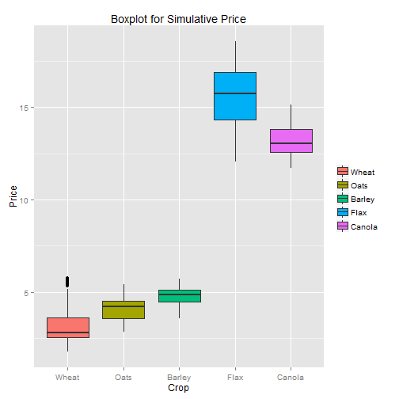
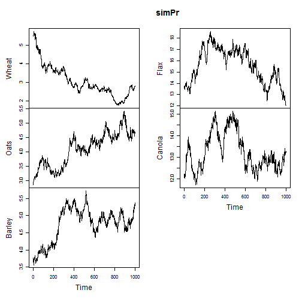
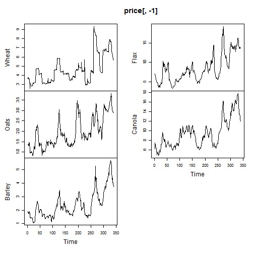
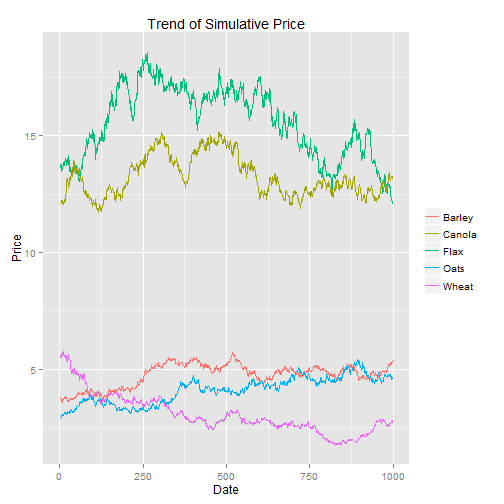

SK Model
========================================================

## data
I got the monthly price data of crops in Alberta from Statistics Canada, [Farm product prices, crops and livestock, monthly         Description (dollars per metric tonne) 002-0043](http://www5.statcan.gc.ca/cansim/a05?lang=eng&id=0020043&pattern=0020043&searchTypeByValue=1&p2=35).


```r
setwd("E:\\Dropbox\\Github\\sk")
price<- read.csv("price.csv", header = T, sep = ",")

# set the date format
price[, 1] <- as.Date(price[, 1], format = "%d/%m/%Y")
# print table for price
library(xtable)
print(xtable(summary(price)), type = "html", include.rownames = F)
```

<!-- html table generated in R 3.0.3 by xtable 1.7-3 package -->
<!-- Fri Aug 15 18:03:18 2014 -->
<TABLE border=1>
<TR> <TH>      date </TH> <TH>     Wheat </TH> <TH>      Oats </TH> <TH>     Barley </TH> <TH>      Flax </TH> <TH>     Canola </TH>  </TR>
  <TR> <TD> Min.   :1985-12-01   </TD> <TD> Min.   :2.551   </TD> <TD> Min.   :0.8228   </TD> <TD> Min.   :1.069   </TD> <TD> Min.   : 3.303   </TD> <TD> Min.   : 4.816   </TD> </TR>
  <TR> <TD> 1st Qu.:1992-12-24   </TD> <TD> 1st Qu.:3.406   </TD> <TD> 1st Qu.:1.3899   </TD> <TD> 1st Qu.:1.646   </TD> <TD> 1st Qu.: 5.679   </TD> <TD> 1st Qu.: 7.044   </TD> </TR>
  <TR> <TD> Median :2000-01-16   </TD> <TD> Median :4.314   </TD> <TD> Median :1.7550   </TD> <TD> Median :2.110   </TD> <TD> Median : 7.780   </TD> <TD> Median : 9.032   </TD> </TR>
  <TR> <TD> Mean   :2000-01-15   </TD> <TD> Mean   :4.604   </TD> <TD> Mean   :1.9396   </TD> <TD> Mean   :2.408   </TD> <TD> Mean   : 8.407   </TD> <TD> Mean   : 9.390   </TD> </TR>
  <TR> <TD> 3rd Qu.:2007-02-08   </TD> <TD> 3rd Qu.:4.945   </TD> <TD> 3rd Qu.:2.4720   </TD> <TD> 3rd Qu.:2.863   </TD> <TD> 3rd Qu.:10.074   </TD> <TD> 3rd Qu.:10.719   </TD> </TR>
  <TR> <TD> Max.   :2014-03-01   </TD> <TD> Max.   :9.341   </TD> <TD> Max.   :3.8197   </TD> <TD> Max.   :5.680   </TD> <TD> Max.   :19.260   </TD> <TD> Max.   :17.731   </TD> </TR>
   </TABLE>


Size of Farms The 2011 Census of Agriculture recorded 36 952 Saskatchewan census farms as of May 10, 2011 a decline of 16.6 per cent from 44 329 census farms as at May 15, 2006.
The total farm land area was recorded at 61.6 million acres – averaging 1 668 acres per farm. In 2006, the average area was 1 449 acres. On average, Saskatchewan has the largest farms in Canada.

### Plot of price

```r
#install.packages("reshape","ggplot2")
#boxplot(price[c(300:340),-1])

library(ggplot2)
histpr<-ggplot(data=melt(price[,-1]), aes(as.factor(variable), value, fill=factor(variable)))
```

```
## Using  as id variables
```

```r
histpr + geom_boxplot() + guides(fill=guide_legend(title=NULL))+labs(title="Boxplot for History Price", x= "Crop", y="Price")
```

 

```r
# line

ggplot(price, aes(price[,1])) + geom_line(aes(y = price[,2], colour = "Wheat")) +  geom_line(aes(y = price[,3], colour = "Barley")) + geom_line(aes(y = price[,4], colour = "Oats")) + geom_line(aes(y = price[,5], colour = "Flax")) + geom_line(aes(y = price[,6], colour = "Calona")) + labs(title="Trend of History Price", x= "Date", y="Price")+ theme(legend.title=element_blank())
```

 

### Get the yield data.


```r
# Read yield data, firs two row are  comment, 
yield<-read.csv("yield.csv", skip =2,  header = T, sep = ",")

# Just take 5 crops and delete 1990 one NA
yield <- yield[-1, c(1:5,7)]
# correct names
names(yield)[c(4,6)]<-c("Flax","Wheat")
#names(yield)
#yield$date<-as.Date(yield$date)
#library(xtable)
yield<-yield[,c("date","Wheat","Oats","Barley","Flax","Canola")]
print(xtable(summary(yield)), type = "html", include.rownames = FALSE)
```

<!-- html table generated in R 3.0.3 by xtable 1.7-3 package -->
<!-- Fri Aug 15 18:03:21 2014 -->
<TABLE border=1>
<TR> <TH>      date </TH> <TH>     Wheat </TH> <TH>      Oats </TH> <TH>     Barley </TH> <TH>      Flax </TH> <TH>     Canola </TH>  </TR>
  <TR> <TD> Min.   :1991   </TD> <TD> Min.   :21.80   </TD> <TD> Min.   :45.30   </TD> <TD> Min.   :33.10   </TD> <TD> Min.   :14.30   </TD> <TD> Min.   :18.60   </TD> </TR>
  <TR> <TD> 1st Qu.:1996   </TD> <TD> 1st Qu.:28.90   </TD> <TD> 1st Qu.:57.60   </TD> <TD> 1st Qu.:46.15   </TD> <TD> 1st Qu.:18.25   </TD> <TD> 1st Qu.:21.35   </TD> </TR>
  <TR> <TD> Median :2002   </TD> <TD> Median :32.00   </TD> <TD> Median :63.60   </TD> <TD> Median :49.50   </TD> <TD> Median :19.80   </TD> <TD> Median :24.50   </TD> </TR>
  <TR> <TD> Mean   :2002   </TD> <TD> Mean   :32.27   </TD> <TD> Mean   :64.26   </TD> <TD> Mean   :50.43   </TD> <TD> Mean   :19.63   </TD> <TD> Mean   :25.62   </TD> </TR>
  <TR> <TD> 3rd Qu.:2008   </TD> <TD> 3rd Qu.:35.35   </TD> <TD> 3rd Qu.:69.10   </TD> <TD> 3rd Qu.:55.60   </TD> <TD> 3rd Qu.:21.00   </TD> <TD> 3rd Qu.:29.25   </TD> </TR>
  <TR> <TD> Max.   :2013   </TD> <TD> Max.   :47.90   </TD> <TD> Max.   :95.30   </TD> <TD> Max.   :66.10   </TD> <TD> Max.   :27.20   </TD> <TD> Max.   :37.60   </TD> </TR>
   </TABLE>

```r
#summary(yield)
head(yield)
```

  date Wheat Oats Barley Flax Canola
2 1991  32.0 49.0   45.5 19.3   22.6
3 1992  29.1 51.8   49.5 16.5   21.0
4 1993  30.9 63.6   52.7 20.8   22.9
5 1994  28.7 62.1   49.3 20.7   21.4
6 1995  29.3 60.0   48.8 20.2   19.0
7 1996  33.9 67.8   55.9 22.7   25.3

## Plot of yield

```r
# boxplot(yield[,-1])
library(reshape)
library(ggplot2)
#library(scales)
histyldb<-ggplot(data=melt(yield[,-1]), aes(as.factor(variable), value, fill=factor(variable)))
```

```
## Using  as id variables
```

```r
histyldb + geom_boxplot() + guides(fill=guide_legend(title=NULL))+labs(title="Boxplot for History Yield", x= "Crop", y="yield")
```

 

```r
# line
histyldl <- ggplot(yield, aes(yield[,1]))
yldBarley <- geom_line(aes(y = yield[,2], colour = "Barley"))
yldCanola <- geom_line(aes(y = yield[,3], colour = "Canola"))
yldFlax<- geom_line(aes(y = yield[,4], colour = "Flax"))
yldOats<- geom_line(aes(y = yield[,5], colour = "Oats"))
yldWheat<-geom_line(aes(y = yield[,6], colour = "Wheat"))

histyldl + yldBarley + yldCanola + yldFlax + yldOats+ yldWheat + labs(title="Trend of History yield", x= "Date", y="yield")+ theme(legend.title=element_blank())
```

 


## Detrand yield and get varibility (standard deviation) of yield for simulation


```r
library(forecast)
source("decomp.r")
str(yield)
```

```
## 'data.frame':	23 obs. of  6 variables:
##  $ date  : int  1991 1992 1993 1994 1995 1996 1997 1998 1999 2000 ...
##  $ Wheat : num  32 29.1 30.9 28.7 29.3 33.9 28.2 29.9 35.4 32.8 ...
##  $ Oats  : num  49 51.8 63.6 62.1 60 67.8 55.2 61.6 64.2 63.1 ...
##  $ Barley: num  45.5 49.5 52.7 49.3 48.8 55.9 46.8 51.4 56 51.3 ...
##  $ Flax  : num  19.3 16.5 20.8 20.7 20.2 22.7 18.2 19.6 20.7 18.6 ...
##  $ Canola: num  22.6 21 22.9 21.4 19 25.3 21.3 23 26.7 25.8 ...
```

```r
sdDtrend <- function(x) sd(decomp(x, FALSE)$remainder)

#sd(decomp(yield$Wheat)$remainder)
#sd(decomp(yield[,3], FALSE)$remainder)
   
sdyld0 <- apply(yield[,-1],2, function(x) sd(x))
sdyld <- apply(yield[,-1],2, function(x) sdDtrend(x))

# recent mean of yield 5 year
meanyld <- apply(yield[19:23,-1],2, mean)
#decomyld<-decomp(yield[,2], FALSE)
#plot(1991:2013,decomyld$trend, type="o")
#plot(1991:2013,decomyld$remainder, type="o" )
```


## yield simulation


## Yield Simulation


```r
simnum=1000
crops=5        
simYld <- array(0, dim=c(simnum, crops))


# yield random 
for (i in 1:simnum) {
        simYld[i,] <- rnorm(crops, meanyld, sdyld)
}
simYld<-as.data.frame(simYld)
names(simYld)<-names(yield)[-1]
write.table(simYld,"simYld.csv", col.names = TRUE,row.names = FALSE, sep=",", )
```


## PMP

(ALPH(k)+0.5*BETA(k)*NX(k)))*NX(k))


## Price simulation 


### parameter estimate


#### GBM parameter estimate for price motion


```r
library(yuima)
```

```
## Loading required package: stats4
## Loading required package: expm
## Loading required package: Matrix
## 
## Attaching package: 'Matrix'
## 
## The following object is masked from 'package:reshape':
## 
##     expand
## 
## 
## Attaching package: 'expm'
## 
## The following object is masked from 'package:Matrix':
## 
##     expm
## 
## ############################################
## This is YUIMA Project package.
## Check for the latest development version at:
## http://R-Forge.R-Project.org/projects/yuima
## ############################################
## 
## Attaching package: 'yuima'
## 
## The following object is masked from 'package:stats':
## 
##     simulate
```

```r
# set gbm model
set.seed(12345)
        
ymodel <- setModel(drift=c("theta2*x"), diffusion=c("theta1*x"),time.variable="t", state.variable="x", solve.variable="x")
        
# initial gbm parament matrix        
gbmPara<- matrix(ncol=2)

# loop for all parameter
for(i in 2:ncol(price)){        
        x <- price[,i]
        Data2=setYuima(data=setData(x),ymodel)
        mle1 <- qmle(Data2, start = list(theta1 = 1, theta2 = -0.001),lower = list(theta1=-2, theta2=-1),upper = list(theta1=0.5, theta2=0.5), method = "L-BFGS-B")
        coef(mle1)
        gbmPara <- rbind(gbmPara, coef(mle1))
        }        
```


### Generate all parameter for all crop price


```r
# set gbmPara
gbmPara<-as.data.frame(gbmPara)
gbmPara<-gbmPara[-1,]
names(gbmPara)<-c("sigma","mu")
row.names(gbmPara) <- names(price)[-1]
# print GBM parameters talbe
print(xtable(gbmPara), type = "html", include.rownames = FALSE)
```

<!-- html table generated in R 3.0.3 by xtable 1.7-3 package -->
<!-- Fri Aug 15 18:03:26 2014 -->
<TABLE border=1>
<TR> <TH> sigma </TH> <TH> mu </TH>  </TR>
  <TR> <TD align="right"> -0.09 </TD> <TD align="right"> 0.00 </TD> </TR>
  <TR> <TD align="right"> -0.08 </TD> <TD align="right"> 0.00 </TD> </TR>
  <TR> <TD align="right"> -0.06 </TD> <TD align="right"> 0.00 </TD> </TR>
  <TR> <TD align="right"> -0.07 </TD> <TD align="right"> 0.00 </TD> </TR>
  <TR> <TD align="right"> -0.05 </TD> <TD align="right"> 0.00 </TD> </TR>
   </TABLE>

```r
# set mean of price as initial value
# meanPr<-apply(price[265:340,-1],2,mean)
# print mean of price talbe
print(xtable(meanPr), type = "html", include.rownames = FALSE)
```

```
Error: error in evaluating the argument 'x' in selecting a method for function 'print': Error in xtable(meanPr) : object 'meanPr' not found
```

```r
# write to talbe csv

write.table(gbmPara, "gbmPara.csv", col.names = TRUE,row.names = T, sep="," )
```


## simulation of crop price


```r
# set sampling, model, frequence
n <- 1000
ysamp <- setSampling(Terminal=(n)^(1/2), n=n) 
```

```
## Warning: 
## YUIMA: 'delta' (re)defined.
```

```r
yuima <- setYuima(model=ymodel, sampling=ysamp)

# set simulative price matrix 1000x
simPr<-matrix(nrow=n+1)
# set initial price as March 2014
initPr<-price[340,-1]
#meanpr<-apply(price[c(265:340),-1], 2, mean)
# set loop for 5 crop sim price
for(j in 1:length(initPr)){
        dyuima <- simulate(yuima, xinit= as.numeric(initPr[j]), true.parameter=list(theta1=gbmPara[j,1],theta2=gbmPara[j,2]))
        as.numeric(dyuima@data@ original.data)
        simPr<-cbind(simPr,as.numeric(dyuima@data@ original.data))
}
```


### Generate simulation price matrix 1000*5


```r
# set gsimPr data.frame
#head(simPr)
# delete the NA in first column and first row  which is  s0
simPr<-as.data.frame(simPr[-1,-1])
names(simPr)<-names(price)[-1]

# print GBM parameters talbe
print(xtable(head(simPr)), type = "html", include.rownames = FALSE )
```

<!-- html table generated in R 3.0.3 by xtable 1.7-3 package -->
<!-- Fri Aug 15 18:03:27 2014 -->
<TABLE border=1>
<TR> <TH> Wheat </TH> <TH> Oats </TH> <TH> Barley </TH> <TH> Flax </TH> <TH> Canola </TH>  </TR>
  <TR> <TD align="right"> 5.57 </TD> <TD align="right"> 2.85 </TD> <TD align="right"> 3.77 </TD> <TD align="right"> 13.60 </TD> <TD align="right"> 12.05 </TD> </TR>
  <TR> <TD align="right"> 5.51 </TD> <TD align="right"> 2.84 </TD> <TD align="right"> 3.72 </TD> <TD align="right"> 13.71 </TD> <TD align="right"> 12.07 </TD> </TR>
  <TR> <TD align="right"> 5.52 </TD> <TD align="right"> 2.88 </TD> <TD align="right"> 3.75 </TD> <TD align="right"> 13.78 </TD> <TD align="right"> 12.05 </TD> </TR>
  <TR> <TD align="right"> 5.56 </TD> <TD align="right"> 2.91 </TD> <TD align="right"> 3.70 </TD> <TD align="right"> 13.78 </TD> <TD align="right"> 12.12 </TD> </TR>
  <TR> <TD align="right"> 5.51 </TD> <TD align="right"> 2.92 </TD> <TD align="right"> 3.64 </TD> <TD align="right"> 13.61 </TD> <TD align="right"> 12.23 </TD> </TR>
  <TR> <TD align="right"> 5.67 </TD> <TD align="right"> 3.00 </TD> <TD align="right"> 3.64 </TD> <TD align="right"> 13.45 </TD> <TD align="right"> 12.22 </TD> </TR>
   </TABLE>

```r
# set mean of price as initial value

write.table(simPr,"simPr.csv", col.names = TRUE,row.names = FALSE, sep=",", )
```


### Plot of simulative price

```r
# library(lattice)
#install.packages("reshape","ggplot2")
#boxplot(price[c(300:340),-1])
#library(reshape)
library(ggplot2)
simPrPlot<-ggplot(data=melt(simPr), aes(as.factor(variable), value, fill=factor(variable)))
```

```
## Using  as id variables
```

```r
simPrPlot + geom_boxplot() + guides(fill=guide_legend(title=NULL))+labs(title="Boxplot for Simulative Price", x= "Crop", y="Price")
```

 

```r
# line

plot.ts(simPr)
```

 

```r
plot.ts(price[,-1])
```

 

```r
reset_index(simPr)
```

```
## Error: could not find function "reset_index"
```

```r
head(simPr)
```

```
##      Wheat     Oats   Barley     Flax   Canola
## 1 5.574054 2.845931 3.771377 13.59546 12.04841
## 2 5.512881 2.843327 3.724974 13.71290 12.06879
## 3 5.523089 2.876638 3.750248 13.78082 12.05123
## 4 5.563095 2.907325 3.703134 13.78468 12.12224
## 5 5.511069 2.922729 3.643407 13.60604 12.22893
## 6 5.668784 2.998029 3.642327 13.45293 12.21563
```

```r
ggplot(simPr, aes(x=1:nrow(simPr))) + geom_line(aes(y = simPr$Wheat, colour = "Wheat")) +  geom_line(aes(y = simPr$Barley, colour = "Barley"))+ geom_line(aes(y = simPr$Oats, colour = "Oats")) + geom_line(aes(y = simPr$Flax, colour = "Flax")) + geom_line(aes(y = simPr$Canola, colour = "Canola"))+ labs(title="Trend of Simulative Price", x= "Date", y="Price")+ theme(legend.title=element_blank())
```

 

## simulation revenue


```r
# clean price matrix
head(simPr)
```

```
##      Wheat     Oats   Barley     Flax   Canola
## 1 5.574054 2.845931 3.771377 13.59546 12.04841
## 2 5.512881 2.843327 3.724974 13.71290 12.06879
## 3 5.523089 2.876638 3.750248 13.78082 12.05123
## 4 5.563095 2.907325 3.703134 13.78468 12.12224
## 5 5.511069 2.922729 3.643407 13.60604 12.22893
## 6 5.668784 2.998029 3.642327 13.45293 12.21563
```

```r
str(simPr)
```

```
## 'data.frame':	1000 obs. of  5 variables:
##  $ Wheat : num  5.57 5.51 5.52 5.56 5.51 ...
##  $ Oats  : num  2.85 2.84 2.88 2.91 2.92 ...
##  $ Barley: num  3.77 3.72 3.75 3.7 3.64 ...
##  $ Flax  : num  13.6 13.7 13.8 13.8 13.6 ...
##  $ Canola: num  12 12.1 12.1 12.1 12.2 ...
```

```r
head(simYld)
```

```
##      Wheat     Oats   Barley     Flax   Canola
## 1 40.53935 73.37570 69.42028 21.49666 32.31057
## 2 43.01770 77.82554 60.53443 23.05691 29.37465
## 3 36.68592 80.49617 63.87256 22.38674 39.16273
## 4 39.95501 75.94130 46.82485 20.27903 31.82337
## 5 40.02380 87.33362 40.01013 25.38078 31.63737
## 6 35.16157 73.97642 66.39405 22.30827 30.43872
```

```r
# swap column to match price
simYld<-simYld[,c("Wheat","Oats","Barley","Flax","Canola")]
# define the revenue
simRev<-simPr[1,]*simYld[1,]
# generate revenue
for (i in 2:simnum) {        
	simRev <- rbind(simRev,(simPr[i,]*simYld[i,])) 
}

write.table(simRev,"simRev.csv", col.names = TRUE,row.names = FALSE, sep=",", )

#head(simRev)
s#im = sapply(1:simnum, function(x) simPr[x,]*simYld[x,])
```

```
## function (..., k = -1, fx = FALSE, bs = "tp", m = NA, by = NA, 
##     xt = NULL, id = NULL, sp = NULL) 
## {
##     vars <- as.list(substitute(list(...)))[-1]
##     d <- length(vars)
##     by.var <- deparse(substitute(by), backtick = TRUE, width.cutoff = 500)
##     if (by.var == ".") 
##         stop("by=. not allowed")
##     term <- deparse(vars[[1]], backtick = TRUE, width.cutoff = 500)
##     if (term[1] == ".") 
##         stop("s(.) not yet supported.")
##     if (d > 1) 
##         for (i in 2:d) {
##             term[i] <- deparse(vars[[i]], backtick = TRUE, width.cutoff = 500)
##             if (term[i] == ".") 
##                 stop("s(.) not yet supported.")
##         }
##     for (i in 1:d) term[i] <- attr(terms(reformulate(term[i])), 
##         "term.labels")
##     k.new <- round(k)
##     if (all.equal(k.new, k) != TRUE) {
##         warning("argument k of s() should be integer and has been rounded")
##     }
##     k <- k.new
##     if (length(unique(term)) != d) 
##         stop("Repeated variables as arguments of a smooth are not permitted")
##     full.call <- paste("s(", term[1], sep = "")
##     if (d > 1) 
##         for (i in 2:d) full.call <- paste(full.call, ",", term[i], 
##             sep = "")
##     label <- paste(full.call, ")", sep = "")
##     if (!is.null(id)) {
##         if (length(id) > 1) {
##             id <- id[1]
##             warning("only first element of `id' used")
##         }
##         id <- as.character(id)
##     }
##     ret <- list(term = term, bs.dim = k, fixed = fx, dim = d, 
##         p.order = m, by = by.var, label = label, xt = xt, id = id, 
##         sp = sp)
##     class(ret) <- paste(bs, ".smooth.spec", sep = "")
##     ret
## }
## <bytecode: 0x000000000db10b98>
## <environment: namespace:mgcv>
```

```r
#str(sim)
```


