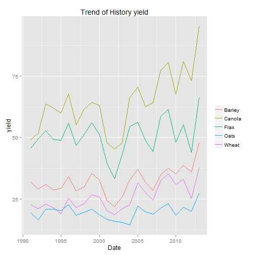

SK Model
========================================================

## data
I got the monthly price data of crops in Alberta from Statistics Canada, [Farm product prices, crops and livestock, monthly         Description (dollars per metric tonne) 002-0043](http://www5.statcan.gc.ca/cansim/a05?lang=eng&id=0020043&pattern=0020043&searchTypeByValue=1&p2=35).


```r
setwd("E:/Dropbox/book/economics/485/projects/nlfarm/finalcode")
price <- read.csv("price.csv", header = T, sep = ",")

# set the date format
price[, 1] <- as.Date(price[, 1], format = "%d/%m/%Y")
# print table for price
library(xtable)
print(xtable(summary(price)), type = "html", include.rownames = F)
```

<!-- html table generated in R 3.0.3 by xtable 1.7-3 package -->
<!-- Mon Jun 23 23:50:23 2014 -->
<TABLE border=1>
<TR> <TH>      date </TH> <TH>     Wheat </TH> <TH>      Oats </TH> <TH>     Barley </TH> <TH>      Flax </TH> <TH>     Canola </TH>  </TR>
  <TR> <TD> Min.   :1985-12-01   </TD> <TD> Min.   :2.55   </TD> <TD> Min.   :0.823   </TD> <TD> Min.   :1.07   </TD> <TD> Min.   : 3.30   </TD> <TD> Min.   : 4.82   </TD> </TR>
  <TR> <TD> 1st Qu.:1992-12-24   </TD> <TD> 1st Qu.:3.41   </TD> <TD> 1st Qu.:1.390   </TD> <TD> 1st Qu.:1.65   </TD> <TD> 1st Qu.: 5.68   </TD> <TD> 1st Qu.: 7.04   </TD> </TR>
  <TR> <TD> Median :2000-01-16   </TD> <TD> Median :4.31   </TD> <TD> Median :1.755   </TD> <TD> Median :2.11   </TD> <TD> Median : 7.78   </TD> <TD> Median : 9.03   </TD> </TR>
  <TR> <TD> Mean   :2000-01-15   </TD> <TD> Mean   :4.60   </TD> <TD> Mean   :1.940   </TD> <TD> Mean   :2.41   </TD> <TD> Mean   : 8.41   </TD> <TD> Mean   : 9.39   </TD> </TR>
  <TR> <TD> 3rd Qu.:2007-02-08   </TD> <TD> 3rd Qu.:4.95   </TD> <TD> 3rd Qu.:2.472   </TD> <TD> 3rd Qu.:2.86   </TD> <TD> 3rd Qu.:10.07   </TD> <TD> 3rd Qu.:10.72   </TD> </TR>
  <TR> <TD> Max.   :2014-03-01   </TD> <TD> Max.   :9.34   </TD> <TD> Max.   :3.820   </TD> <TD> Max.   :5.68   </TD> <TD> Max.   :19.26   </TD> <TD> Max.   :17.73   </TD> </TR>
   </TABLE>


Size of Farms The 2011 Census of Agriculture recorded 36 952 Saskatchewan census farms as of May 10, 2011 a decline of 16.6 per cent from 44 329 census farms as at May 15, 2006.
The total farm land area was recorded at 61.6 million acres – averaging 1 668 acres per farm. In 2006, the average area was 1 449 acres. On average, Saskatchewan has the largest farms in Canada.

### Plot of price

```r

# install.packages('reshape','ggplot2') boxplot(price[c(300:340),-1])

library(ggplot2)
histpr <- ggplot(data = melt(price[, -1]), aes(as.factor(variable), value, fill = factor(variable)))
```

```
## Using  as id variables
```

```r
histpr + geom_boxplot() + guides(fill = guide_legend(title = NULL)) + labs(title = "Boxplot for History Price", 
    x = "Crop", y = "Price")
```

 

```r
# line

ggplot(price, aes(price[, 1])) + geom_line(aes(y = price[, 2], colour = "Wheat")) + 
    geom_line(aes(y = price[, 3], colour = "Barley")) + geom_line(aes(y = price[, 
    4], colour = "Oats")) + geom_line(aes(y = price[, 5], colour = "Flax")) + 
    geom_line(aes(y = price[, 6], colour = "Calona")) + labs(title = "Trend of History Price", 
    x = "Date", y = "Price") + theme(legend.title = element_blank())
```

 


### Get the yield data.


```r
# Read yield data, firs two row are comment,
yield <- read.csv("yield.csv", skip = 2, header = T, sep = ",")

# Just take 5 crops and delete 1990 one NA
yield <- yield[-1, c(1:5, 7)]
# correct names
names(yield)[c(4, 6)] <- c("Flax", "Wheat")
# names(yield) yield$date<-as.Date(yield$date) library(xtable)
print(xtable(summary(yield)), type = "html", include.rownames = FALSE)
```

<!-- html table generated in R 3.0.3 by xtable 1.7-3 package -->
<!-- Mon Jun 23 23:50:27 2014 -->
<TABLE border=1>
<TR> <TH>      date </TH> <TH>     Barley </TH> <TH>     Canola </TH> <TH>      Flax </TH> <TH>      Oats </TH> <TH>     Wheat </TH>  </TR>
  <TR> <TD> Min.   :1991   </TD> <TD> Min.   :33.1   </TD> <TD> Min.   :18.6   </TD> <TD> Min.   :14.3   </TD> <TD> Min.   :45.3   </TD> <TD> Min.   :21.8   </TD> </TR>
  <TR> <TD> 1st Qu.:1996   </TD> <TD> 1st Qu.:46.1   </TD> <TD> 1st Qu.:21.4   </TD> <TD> 1st Qu.:18.2   </TD> <TD> 1st Qu.:57.6   </TD> <TD> 1st Qu.:28.9   </TD> </TR>
  <TR> <TD> Median :2002   </TD> <TD> Median :49.5   </TD> <TD> Median :24.5   </TD> <TD> Median :19.8   </TD> <TD> Median :63.6   </TD> <TD> Median :32.0   </TD> </TR>
  <TR> <TD> Mean   :2002   </TD> <TD> Mean   :50.4   </TD> <TD> Mean   :25.6   </TD> <TD> Mean   :19.6   </TD> <TD> Mean   :64.3   </TD> <TD> Mean   :32.3   </TD> </TR>
  <TR> <TD> 3rd Qu.:2008   </TD> <TD> 3rd Qu.:55.6   </TD> <TD> 3rd Qu.:29.2   </TD> <TD> 3rd Qu.:21.0   </TD> <TD> 3rd Qu.:69.1   </TD> <TD> 3rd Qu.:35.4   </TD> </TR>
  <TR> <TD> Max.   :2013   </TD> <TD> Max.   :66.1   </TD> <TD> Max.   :37.6   </TD> <TD> Max.   :27.2   </TD> <TD> Max.   :95.3   </TD> <TD> Max.   :47.9   </TD> </TR>
   </TABLE>

```r
# summary(yield)
```


## Plot of yield

```r
# boxplot(yield[,-1])
library(reshape)
library(ggplot2)
# library(scales)
histyldb <- ggplot(data = melt(yield[, -1]), aes(as.factor(variable), value, 
    fill = factor(variable)))
```

```
## Using  as id variables
```

```r
histyldb + geom_boxplot() + guides(fill = guide_legend(title = NULL)) + labs(title = "Boxplot for History Yield", 
    x = "Crop", y = "yield")
```

 

```r
# line
histyldl <- ggplot(yield, aes(yield[, 1]))
yldBarley <- geom_line(aes(y = yield[, 2], colour = "Barley"))
yldCanola <- geom_line(aes(y = yield[, 3], colour = "Canola"))
yldFlax <- geom_line(aes(y = yield[, 4], colour = "Flax"))
yldOats <- geom_line(aes(y = yield[, 5], colour = "Oats"))
yldWheat <- geom_line(aes(y = yield[, 6], colour = "Wheat"))

histyldl + yldBarley + yldCanola + yldFlax + yldOats + yldWheat + labs(title = "Trend of History yield", 
    x = "Date", y = "yield") + theme(legend.title = element_blank())
```

 


## Detrand yield and get varibility (standard deviation) of yield for simulation


```r
library(forecast)
source("decomp.r")
str(yield)
```

```
## 'data.frame':	23 obs. of  6 variables:
##  $ date  : int  1991 1992 1993 1994 1995 1996 1997 1998 1999 2000 ...
##  $ Barley: num  45.5 49.5 52.7 49.3 48.8 55.9 46.8 51.4 56 51.3 ...
##  $ Canola: num  22.6 21 22.9 21.4 19 25.3 21.3 23 26.7 25.8 ...
##  $ Flax  : num  19.3 16.5 20.8 20.7 20.2 22.7 18.2 19.6 20.7 18.6 ...
##  $ Oats  : num  49 51.8 63.6 62.1 60 67.8 55.2 61.6 64.2 63.1 ...
##  $ Wheat : num  32 29.1 30.9 28.7 29.3 33.9 28.2 29.9 35.4 32.8 ...
```

```r
sdDtrend <- function(x) sd(decomp(x, FALSE)$remainder)
# sd(decomp(yield$Wheat)$remainder) sd(decomp(yield[,3], FALSE)$remainder)

sdyld0 <- apply(yield[, -1], 2, function(x) sd(x))
sdyld <- apply(yield[, -1], 2, function(x) sdDtrend(x))

# recent mean of yield 5 year
meanyld <- apply(yield[19:23, -1], 2, mean)
```


## yield simulation


## Yield Simulation


```r
simnum = 1000
crops = 5
simYld <- array(0, dim = c(simnum, crops))


# yield random
for (i in 1:simnum) {
    simYld[i, ] <- rnorm(crops, meanyld, sdyld)
}
simYld <- as.data.frame(simYld)
names(simYld) <- names(yield)[-1]
write.table(simYld, "simYld.csv", col.names = TRUE, row.names = FALSE, sep = ",", 
    )
```


## Price simulation 


### parameter estimate


#### GBM parameter estimate for price motion


```r
library(yuima)
```

```
## Loading required package: stats4
## Loading required package: expm
## Loading required package: Matrix
## 
## Attaching package: 'Matrix'
## 
## The following object is masked from 'package:reshape':
## 
##     expand
## 
## 
## Attaching package: 'expm'
## 
## The following object is masked from 'package:Matrix':
## 
##     expm
## 
## ############################################
## This is YUIMA Project package.
## Check for the latest development version at:
## http://R-Forge.R-Project.org/projects/yuima
## ############################################
## 
## Attaching package: 'yuima'
## 
## The following object is masked from 'package:stats':
## 
##     simulate
```

```r
# set gbm model
set.seed(12345)

ymodel <- setModel(drift = c("theta2*x"), diffusion = c("theta1*x"), time.variable = "t", 
    state.variable = "x", solve.variable = "x")

# initial gbm parament matrix
gbmPara <- matrix(ncol = 2)

# loop for all parameter
for (i in 2:ncol(price)) {
    x <- price[, i]
    Data2 = setYuima(data = setData(x), ymodel)
    mle1 <- qmle(Data2, start = list(theta1 = 1, theta2 = -0.001), lower = list(theta1 = -2, 
        theta2 = -1), upper = list(theta1 = 0.5, theta2 = 0.5), method = "L-BFGS-B")
    coef(mle1)
    gbmPara <- rbind(gbmPara, coef(mle1))
}
```


### Generate all parameter for all crop price


```r
# set gbmPara
gbmPara <- as.data.frame(gbmPara)
gbmPara <- gbmPara[-1, ]
names(gbmPara) <- c("sigma", "mu")
row.names(gbmPara) <- names(price)[-1]
# print GBM parameters talbe
print(xtable(gbmPara), type = "html", include.rownames = FALSE)
```

<!-- html table generated in R 3.0.3 by xtable 1.7-3 package -->
<!-- Mon Jun 23 23:50:54 2014 -->
<TABLE border=1>
<TR> <TH> sigma </TH> <TH> mu </TH>  </TR>
  <TR> <TD align="right"> -0.09 </TD> <TD align="right"> 0.00 </TD> </TR>
  <TR> <TD align="right"> -0.08 </TD> <TD align="right"> 0.00 </TD> </TR>
  <TR> <TD align="right"> -0.06 </TD> <TD align="right"> 0.00 </TD> </TR>
  <TR> <TD align="right"> -0.07 </TD> <TD align="right"> 0.00 </TD> </TR>
  <TR> <TD align="right"> -0.05 </TD> <TD align="right"> 0.00 </TD> </TR>
   </TABLE>

```r
# set mean of price as initial value meanPr<-apply(price[265:340,-1],2,mean)
# print mean of price talbe
print(xtable(meanPr), type = "html", include.rownames = FALSE)
```

```
Error: error in evaluating the argument 'x' in selecting a method for function 'print': Error in xtable(meanPr) : object 'meanPr' not found
```

```r
# write to talbe csv

write.table(gbmPara, "gbmPara.csv", col.names = TRUE, row.names = T, sep = ",")
```


## simulation of crop price


```r

# set sampling, model, frequence
n <- 1000
ysamp <- setSampling(Terminal = (n)^(1/2), n = n)
```

```
## Warning: 
## YUIMA: 'delta' (re)defined.
```

```r
yuima <- setYuima(model = ymodel, sampling = ysamp)

# set simulative price matrix 1000x
simPr <- matrix(nrow = n + 1)

# set loop for 5 crop sim price
for (j in 1:length(meanPr)) {
    dyuima <- simulate(yuima, xinit = meanPr[j], true.parameter = list(theta1 = gbmPara[j, 
        1], theta2 = gbmPara[j, 2]))
    as.numeric(dyuima@data@original.data)
    simPr <- cbind(simPr, as.numeric(dyuima@data@original.data))
}
```

```
## Error: object 'meanPr' not found
```

```r

```


### Generate simulation price matrix 1000*5


```r
# set gsimPr data.frame
head(simPr)
```

     [,1]
[1,]   NA
[2,]   NA
[3,]   NA
[4,]   NA
[5,]   NA
[6,]   NA

```r
# delete the NA in first column and first row which is s0
simPr <- as.data.frame(simPr[-1, -1])
names(simPr) <- names(price)[-1]
```

```
Error: 'names' attribute [5] must be the same length as the vector [0]
```

```r

# print GBM parameters talbe
print(xtable(head(simPr)), type = "html", include.rownames = FALSE)
```

```
Error: error in evaluating the argument 'x' in selecting a method for function 'print': Error in characters | factors : 
  operations are possible only for numeric, logical or complex types
Calls: xtable -> xtable.data.frame
```

```r
# set mean of price as initial value

write.table(simPr, "simPr.csv", col.names = TRUE, row.names = FALSE, sep = ",", 
    )
```


### Plot of simulative price

```r
library(lattice)
# install.packages('reshape','ggplot2') boxplot(price[c(300:340),-1])
# library(reshape)
library(ggplot2)
simPrPlot <- ggplot(data = melt(simPr), aes(as.factor(variable), value, fill = factor(variable)))
```

```
## Using  as id variables
```

```
## Warning: is.na() applied to non-(list or vector) of type 'NULL'
```

```r
simPrPlot + geom_boxplot() + guides(fill = guide_legend(title = NULL)) + labs(title = "Boxplot for Simulative Price", 
    x = "Crop", y = "Price")
```

```
## Error: arguments imply differing number of rows: 1000, 0
```

```r
# line
1:nrow(simPr)
```

```
##    [1]    1    2    3    4    5    6    7    8    9   10   11   12   13
##   [14]   14   15   16   17   18   19   20   21   22   23   24   25   26
##   [27]   27   28   29   30   31   32   33   34   35   36   37   38   39
##   [40]   40   41   42   43   44   45   46   47   48   49   50   51   52
##   [53]   53   54   55   56   57   58   59   60   61   62   63   64   65
##   [66]   66   67   68   69   70   71   72   73   74   75   76   77   78
##   [79]   79   80   81   82   83   84   85   86   87   88   89   90   91
##   [92]   92   93   94   95   96   97   98   99  100  101  102  103  104
##  [105]  105  106  107  108  109  110  111  112  113  114  115  116  117
##  [118]  118  119  120  121  122  123  124  125  126  127  128  129  130
##  [131]  131  132  133  134  135  136  137  138  139  140  141  142  143
##  [144]  144  145  146  147  148  149  150  151  152  153  154  155  156
##  [157]  157  158  159  160  161  162  163  164  165  166  167  168  169
##  [170]  170  171  172  173  174  175  176  177  178  179  180  181  182
##  [183]  183  184  185  186  187  188  189  190  191  192  193  194  195
##  [196]  196  197  198  199  200  201  202  203  204  205  206  207  208
##  [209]  209  210  211  212  213  214  215  216  217  218  219  220  221
##  [222]  222  223  224  225  226  227  228  229  230  231  232  233  234
##  [235]  235  236  237  238  239  240  241  242  243  244  245  246  247
##  [248]  248  249  250  251  252  253  254  255  256  257  258  259  260
##  [261]  261  262  263  264  265  266  267  268  269  270  271  272  273
##  [274]  274  275  276  277  278  279  280  281  282  283  284  285  286
##  [287]  287  288  289  290  291  292  293  294  295  296  297  298  299
##  [300]  300  301  302  303  304  305  306  307  308  309  310  311  312
##  [313]  313  314  315  316  317  318  319  320  321  322  323  324  325
##  [326]  326  327  328  329  330  331  332  333  334  335  336  337  338
##  [339]  339  340  341  342  343  344  345  346  347  348  349  350  351
##  [352]  352  353  354  355  356  357  358  359  360  361  362  363  364
##  [365]  365  366  367  368  369  370  371  372  373  374  375  376  377
##  [378]  378  379  380  381  382  383  384  385  386  387  388  389  390
##  [391]  391  392  393  394  395  396  397  398  399  400  401  402  403
##  [404]  404  405  406  407  408  409  410  411  412  413  414  415  416
##  [417]  417  418  419  420  421  422  423  424  425  426  427  428  429
##  [430]  430  431  432  433  434  435  436  437  438  439  440  441  442
##  [443]  443  444  445  446  447  448  449  450  451  452  453  454  455
##  [456]  456  457  458  459  460  461  462  463  464  465  466  467  468
##  [469]  469  470  471  472  473  474  475  476  477  478  479  480  481
##  [482]  482  483  484  485  486  487  488  489  490  491  492  493  494
##  [495]  495  496  497  498  499  500  501  502  503  504  505  506  507
##  [508]  508  509  510  511  512  513  514  515  516  517  518  519  520
##  [521]  521  522  523  524  525  526  527  528  529  530  531  532  533
##  [534]  534  535  536  537  538  539  540  541  542  543  544  545  546
##  [547]  547  548  549  550  551  552  553  554  555  556  557  558  559
##  [560]  560  561  562  563  564  565  566  567  568  569  570  571  572
##  [573]  573  574  575  576  577  578  579  580  581  582  583  584  585
##  [586]  586  587  588  589  590  591  592  593  594  595  596  597  598
##  [599]  599  600  601  602  603  604  605  606  607  608  609  610  611
##  [612]  612  613  614  615  616  617  618  619  620  621  622  623  624
##  [625]  625  626  627  628  629  630  631  632  633  634  635  636  637
##  [638]  638  639  640  641  642  643  644  645  646  647  648  649  650
##  [651]  651  652  653  654  655  656  657  658  659  660  661  662  663
##  [664]  664  665  666  667  668  669  670  671  672  673  674  675  676
##  [677]  677  678  679  680  681  682  683  684  685  686  687  688  689
##  [690]  690  691  692  693  694  695  696  697  698  699  700  701  702
##  [703]  703  704  705  706  707  708  709  710  711  712  713  714  715
##  [716]  716  717  718  719  720  721  722  723  724  725  726  727  728
##  [729]  729  730  731  732  733  734  735  736  737  738  739  740  741
##  [742]  742  743  744  745  746  747  748  749  750  751  752  753  754
##  [755]  755  756  757  758  759  760  761  762  763  764  765  766  767
##  [768]  768  769  770  771  772  773  774  775  776  777  778  779  780
##  [781]  781  782  783  784  785  786  787  788  789  790  791  792  793
##  [794]  794  795  796  797  798  799  800  801  802  803  804  805  806
##  [807]  807  808  809  810  811  812  813  814  815  816  817  818  819
##  [820]  820  821  822  823  824  825  826  827  828  829  830  831  832
##  [833]  833  834  835  836  837  838  839  840  841  842  843  844  845
##  [846]  846  847  848  849  850  851  852  853  854  855  856  857  858
##  [859]  859  860  861  862  863  864  865  866  867  868  869  870  871
##  [872]  872  873  874  875  876  877  878  879  880  881  882  883  884
##  [885]  885  886  887  888  889  890  891  892  893  894  895  896  897
##  [898]  898  899  900  901  902  903  904  905  906  907  908  909  910
##  [911]  911  912  913  914  915  916  917  918  919  920  921  922  923
##  [924]  924  925  926  927  928  929  930  931  932  933  934  935  936
##  [937]  937  938  939  940  941  942  943  944  945  946  947  948  949
##  [950]  950  951  952  953  954  955  956  957  958  959  960  961  962
##  [963]  963  964  965  966  967  968  969  970  971  972  973  974  975
##  [976]  976  977  978  979  980  981  982  983  984  985  986  987  988
##  [989]  989  990  991  992  993  994  995  996  997  998  999 1000
```

```r
plot.ts(simPr)
```

```
## Warning: no non-missing arguments to min; returning Inf
## Warning: no non-missing arguments to max; returning -Inf
```

```
## Error: need finite 'ylim' values
```

 

```r
plot.ts(price[, -1])
reset_index(simPr)
```

```
## Error: could not find function "reset_index"
```

```r
head(simPr)
```

```
## data frame with 0 columns and 6 rows
```

```r
ggplot(simPr, aes(x = 1:nrow(simPr))) + geom_line(aes(y = simPr$Wheat, colour = "Wheat")) + 
    geom_line(aes(y = simPr$Barley, colour = "Barley")) + geom_line(aes(y = simPr$Oats, 
    colour = "Oats")) + geom_line(aes(y = simPr$Flax, colour = "Flax")) + geom_line(aes(y = simPr$Canola, 
    colour = "Calona")) + labs(title = "Trend of Simulative Price", x = "Date", 
    y = "Price") + theme(legend.title = element_blank())
```

```
## Error: arguments imply differing number of rows: 1000, 0
```


## simulation revenue


```r


# clean price matrix
head(simPr)
```

```
## data frame with 0 columns and 6 rows
```

```r
str(simPr)
```

```
## 'data.frame':	1000 obs. of  0 variables
```

```r
head(simYld)
```

```
##   Barley Canola  Flax  Oats Wheat
## 1  52.14  35.02 24.80 74.91 41.43
## 2  59.49  38.54 20.65 81.11 41.74
## 3  52.95  27.22 19.99 81.00 35.63
## 4  60.51  35.49 20.27 81.72 41.97
## 5  50.00  37.56 23.38 83.06 35.60
## 6  57.62  26.21 23.32 81.28 29.87
```

```r
# swap column to match price
simYld <- simYld[, c("Wheat", "Oats", "Barley", "Flax", "Canola")]
# define the revenue
simRev <- simPr[1, ] * simYld[1, ]
```

```
## Error: * only defined for equally-sized data frames
```

```r
# generate revenue
for (i in 2:simnum) {
    simRev <- rbind(simRev, (simPr[i, ] * simYld[i, ]))
}
```

```
## Error: object 'simRev' not found
```

```r

write.table(simRev, "simRev.csv", col.names = TRUE, row.names = FALSE, sep = ",", 
    )
```

```
## Error: object 'simRev' not found
```

```r

```


